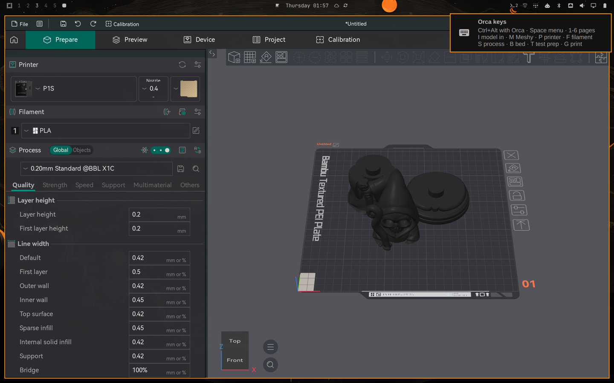
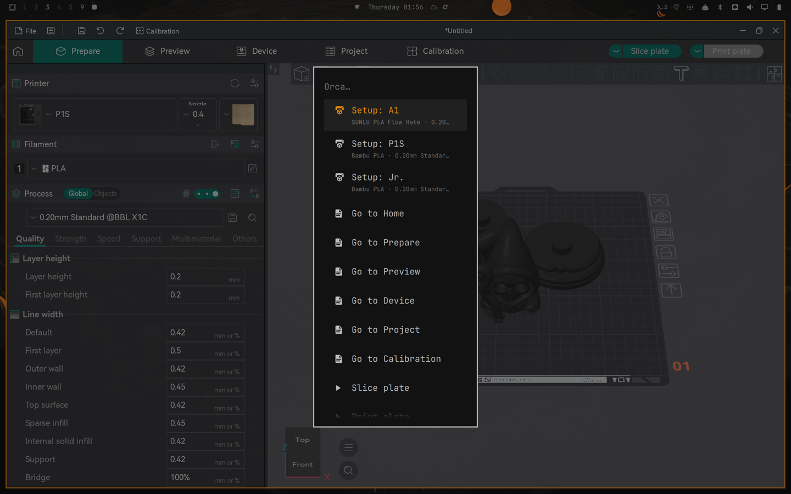
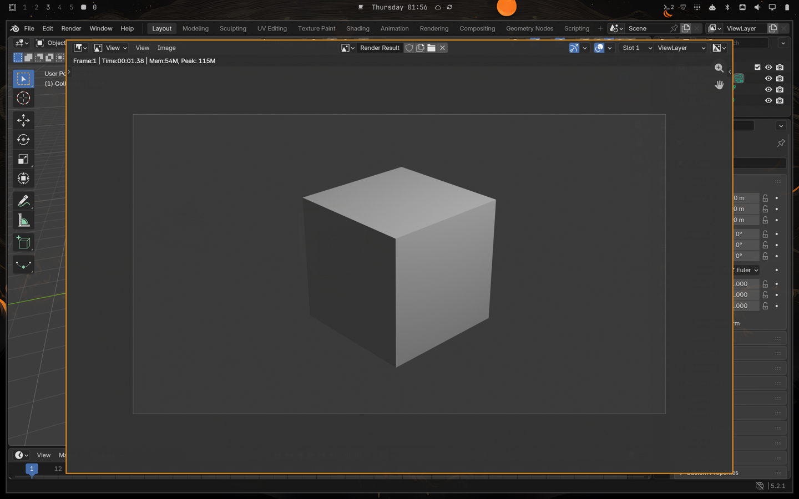
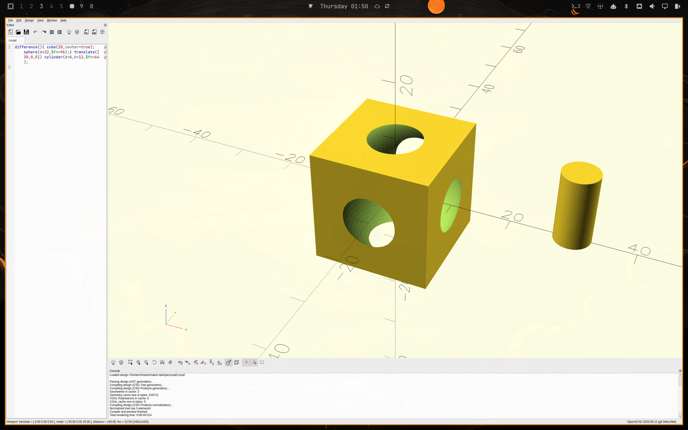

# omarchy-maker

The maker desk for Omarchy: slicers that behave, OrcaSlicer from the keyboard, models from a
sentence, Blender and OpenSCAD in the workflow, and your printers in the bar.

Omarchy 4 is a great desk for people who make things, until the slicer opens. The official
OrcaSlicer and Bambu Studio builds need Omarchy-specific fixes to behave, their lists ignore the
keyboard on Wayland, every new window tiles over the one you are in, and nobody packages any of that.
omarchy-maker does: one installer, the official releases, the fixes, and a way of working that needs
two keys.

- **Slicers that behave.** OrcaSlicer and Bambu Studio from their official releases, unpacked (no FUSE 2
  on Omarchy), the certificate prompt gone, the cursor trap gone, file types wired up, the drag-and-drop
  crash worked around. Entries in Omarchy's own menus. [What it fixes](#what-it-fixes)
- **OrcaSlicer from the keyboard.** Control + Alt + one key for the pages, presets and print window that
  only take the mouse on Wayland, and one menu with everything in words. Orca's own keys are never touched.
  [The keys](#orcaslicer-from-the-keyboard)
- **A model from a sentence.** Describe it or give a picture; Meshy makes it, maker checks and repairs it,
  sizes it, stands it on the plate and hands it to the running Orca. [Models from Meshy](#models-from-meshy)
- **Ready for a test print in one key.** Laid down, 10% infill, no brim, and only the supports it really
  needs, weighed rather than guessed. [Test print](#orcaslicer-from-the-keyboard)
- **Kits.** A figure too big for one print is cut into parts that slot together, each rendered before it
  is printed. Blender does the cutting; OpenSCAD is there for the parametric bits.
  [Blender](#blender-for-the-geometry-a-slicer-cannot-do), [OpenSCAD](#openscad)
- **No tiling for the maker apps.** Each one has a workspace of its own and the pop-ups float where you
  can use them. [No tiling](#no-tiling-for-the-maker-apps)
- **Printers in the bar.** Bambu Lab over your own network and Klipper through Moonraker: progress in the
  bar, a panel with every printer, a notification when a print ends. [Printers](#printers-in-the-bar)



Everything here was built and checked on a real Omarchy 4.0.3 machine and is covered by tests
(81 unit tests, a 72-check install-use-uninstall smoke run, and a live self-check against Orca).

## What it fixes

| On a stock Omarchy 4 | With omarchy-maker | |
|---|---|---|
| OrcaSlicer and Bambu Studio ask about the system certificate store on every launch | the launchers point them at Arch's CA bundle | fixed |
| The AppImages will not start: Omarchy does not include FUSE 2 | maker unpacks them into your home directory | fixed |
| OrcaSlicer: Ctrl+Shift+G in Preview traps the cursor ([OrcaSlicer #15338](https://github.com/OrcaSlicer/OrcaSlicer/issues/15338)) | a Hyprland rule turns off focus-follows-mouse for OrcaSlicer, the same rule Omarchy ships for JetBrains IDEs | fixed |
| Double-clicking a .3mf opens the file manager | .3mf opens in Bambu Studio, .stl/.step/.obj in OrcaSlicer, unless you already chose | fixed |
| The printer camera in the Device tab fails: "missing H.264 codecs for GStreamer" | `maker doctor` names the three packages to add (`omarchy pkg add gst-libav gst-plugins-good gst-plugins-bad`) | needs your password once |
| Bambu Studio crashes when a file is dragged in while the clipboard holds anything ([Bambu Studio #12052](https://github.com/bambulab/BambuStudio/issues/12052), [Hyprland #11179](https://github.com/hyprwm/Hyprland/discussions/11179)) | double-click, Open With and `maker open` land files in the Bambu Studio window that is already open | workaround; dragging still crashes until Hyprland or Bambu Studio fix it |
| OrcaSlicer's page tabs, preset lists and print window only answer the mouse on Wayland | Control + Alt + one key for each, read off the screen and clicked for you, checked in Orca's own settings | fixed; an upstream patch is on the roadmap |
| A Blender or OpenSCAD opened next to Orca takes half of it; Blender's Preferences, render and file browser windows tile too, or come up 320 x 240 | each maker app has a workspace of its own, Blender's pop-ups float at a usable size | fixed |
| OrcaSlicer stutters after sitting idle: zram swap had pushed 566 MB of it out | the slicers run in a scope with swap off and three times the CPU share | fixed |
| OpenSCAD: Arch's package is the 2021 release without Manifold; the current AppImage has no Wayland Qt plugin and lands on XWayland unscaled | `maker install openscad` takes the daily build, runs it on XWayland on purpose and scales it to the screen | fixed |
| Blender's own Ctrl+Alt shortcuts collide with anything bound globally | the Orca keys act only with Orca in front; any other app gets the chord untouched | fixed |

Every row was reproduced and checked on an Omarchy 4.0.3 machine; [FIXES.md](FIXES.md) has the
steps and the evidence.

## Install

One line, from the latest release:

```bash
curl -fsSL https://github.com/LayerMakerLab/omarchy-maker/releases/latest/download/install-omarchy-maker.sh | bash
```

It downloads the release, checks it against the published checksum, unpacks it into
`~/.local/share/omarchy-maker/checkout` and runs the installer there, which asks which apps to download.
Put `-s -- --apps orca,bambu,openscad` after `bash` to say it up front. The same line again updates.

Or from a clone, if you want to follow the code:

```bash
git clone https://github.com/LayerMakerLab/omarchy-maker ~/.local/share/omarchy-maker/checkout
cd ~/.local/share/omarchy-maker/checkout
./install.sh                              # asks which apps to download
./install.sh --apps orca,bambu,openscad   # or say it up front
./install.sh --dry-run                    # show what would change
```

No sudo. It needs `curl` and `jq`, which Omarchy has. `maker doctor` afterwards says what else would
help (Blender from pacman for kits, the H.264 codecs for the printer camera). `./uninstall.sh` puts
everything back.

## Use

- **Ctrl+Alt+O** brings OrcaSlicer, **Ctrl+Alt+Space** lists everything else. That is all there is to
  remember; the rest is below for when you want it.
- Omarchy menu: **Install > 3D Printing** (OrcaSlicer, Bambu Studio), **Setup > 3D Printing** (health
  check), **Update > Slicers**.
- The apps show up in the app launcher like any other app, with the fixes applied.
- In a terminal:

```text
maker doctor                          check the setup and say what to fix
maker install orca|bambu|openscad     download the latest official release
maker update                          update what maker installed
maker open FILE...                    open models in the right slicer, .scad in OpenSCAD
maker default 3mf|model APP           pick which slicer opens .3mf files, or .stl/.step/.obj files
maker remove orca|bambu|openscad      delete an app maker installed (its settings stay)
maker keys                            the Orca keys
maker meshy ...                       models from Meshy (maker meshy --help)
maker printer ...                     printers in the bar
```

If you already installed a slicer from the AUR, maker leaves the package alone and only gives it a
launcher with the fixes.

## OrcaSlicer from the keyboard

On Wayland, OrcaSlicer's page tabs and preset lists only answer the mouse. omarchy-maker adds keys for them,
and every one of them is **Control + Alt + one key** (Control + Option on an Apple keyboard), pressed with
Orca in front. Orca's own shortcuts are Ctrl, Ctrl+Shift, single letters, arrows, Tab and Esc, and never
Ctrl+Alt, so the two sets never mix: there is no mode to be in or out of, and Orca's m (move), r (rotate),
s (scale), f (on bed) and 1-9 (filament) always mean what Orca says. With another app in front the chord
goes to that app untouched (Blender has Ctrl+Alt+Space, Ctrl+Alt+S and Ctrl+Alt+Q of its own).



Two keys are enough to remember: **Ctrl+Alt+O** brings Orca from anywhere, and **Ctrl+Alt+Space** lists
everything else in words, including Blender, OpenSCAD and Bambu Studio to open or bring forward. `maker
keys` prints the list; Ctrl+Alt+H shows it on screen.

| Key | Does |
|---|---|
| `Ctrl+Alt+O` | OrcaSlicer: open it, or bring it forward (from anywhere) |
| `Ctrl+Alt+Space` | one menu with everything: pages, actions, your setups, every preset read so far, and Blender, OpenSCAD and Bambu Studio (type to find it) |
| `Ctrl+Alt+1` to `6` | Home, Prepare, Preview, Device, Project, Calibration |
| `Ctrl+Alt+I` | put a model on the plate: your Meshy models first (at the height you pick), then model files in Downloads and `~/Projects/3D_Exports`, and Orca's recent projects |
| `Ctrl+Alt+M` | make a model with Meshy (below) |
| `Ctrl+Alt+P` | a whole setup (printer, filament, process, plate type in one go), or just a printer |
| `Ctrl+Alt+F` / `S` / `B` | pick the filament, the process preset (the slicing profile) or the bed's plate type |
| `Ctrl+Alt+G` | print: opens Orca's print window (slicing first if needed) and asks which printer (below) |
| `Ctrl+Alt+T` | get the plate ready for a test print (below) |
| `Ctrl+Alt+K` | cut a model into parts that slot together, and put them all on the plate (below) |
| `Ctrl+Alt+V` | speeds: a touch off every printing speed, bridges slower still, overhangs a touch quicker (session only; `maker-orca speeds --revert` puts them back) |
| `Ctrl+Alt+[` / `]` | previous / next plate (picked in Preview's plate list, then back to the page you were on) |
| `Ctrl+Alt+H` | show these keys |
| `Esc` | closes the pop-up in front: Orca's own key. If Orca's main window holds the focus while a pop-up is still up (a menu or a click can leave it that way), Esc is handed to the pop-up |

Slice, print, export, search and preferences are Orca's own Ctrl+R, Ctrl+Shift+G, Ctrl+G, Ctrl+F and Ctrl+P,
and in the 3D view Tab switches Prepare and Preview, A arranges, Q orients and `?` lists the rest.

### No tiling for the maker apps

Hyprland tiles every new window next to the one you are in, so a Blender or OpenSCAD opened beside Orca took
half of it. Each maker app has a workspace of its own instead (Bambu Studio 7, OpenSCAD 8, Blender 9,
OrcaSlicer 10), placed by window rules, and Blender's Preferences, render result and file browser float in
the middle at a usable size instead of tiling (or coming up 320 x 240, which is what Blender 5.2 asks for on
Wayland). Nothing has to be remembered for that: Ctrl+Alt+O and the Ctrl+Alt+Space menu switch to the app,
whatever workspace it is on.

OrcaSlicer also runs in a systemd scope of its own (`maker-run`) with swap off and three times the CPU share:
on a laptop with zram swap the kernel had pushed 566 MB of a running Orca out, which shows up as stutter
when a model is rotated after a pause.

### Setups

A setup is the combination you always use on one printer. Put yours in
`~/.config/omarchy-maker/orca-setups.json`; `maker-orca setups` lists them:

```json
{
  "setups": [
    {"name": "A1", "printer": "A1", "filaments": ["Bambu PLA Basic @BBL A1"],
     "process": "0.20mm Standard @BBL A1", "plate": "Textured PEI Plate"}
  ]
}
```

Names are exactly as Orca shows them. `filaments` fills slot 1, 2 and so on; slots a printer does not
have are skipped. `maker-orca setup A1` applies one from a terminal.

### How it works, and how fast

`maker-orca` finds Orca's tabs and lists on the screen (Tesseract reads the labels once), clicks with a
virtual pointer, puts the pointer back, and checks in Orca's settings that the preset really changed.
What it has read is kept in `~/.cache/omarchy-maker/orca-layout.json` until your presets or the window
change, so after the first time a page switch takes about half a second and a preset about 1.5 seconds
(a list is read the first time it is used: 6 to 10 seconds). A setup takes as long as the presets it
really changes. `Ctrl+Alt+G` with the print window open takes about 1.3 seconds; Orca's verdict shows first and
the plate photo joins it, and the printer you used last is the top row (Enter). Slicing itself is Orca's:
it grows with the size of the print (a 60 mm owl 4.6 s, 180 mm 21 s), hardly with the detail of the mesh
(a copy with a third of the triangles sliced only 8-13% faster).

It needs `grim` and `tesseract` (both on Omarchy) and a build of
[wlrctl](https://git.sr.ht/~brocellous/wlrctl) with a mouse-wheel action, which `install.sh`
compiles (base-devel).

`Ctrl+Alt+G` clicks Orca's Print plate button, reads the printer list in Orca's print window and asks in an
Omarchy menu which printer to use; Orca's log confirms the switch and says whether the printer is
ready. Printer first: when one of your setups is named after the printer you pick and the plate was
sliced with another printer preset (Orca refuses to send an A1 a plate sliced for a P1S), `Ctrl+Alt+G` applies
that setup, slices again and then picks the printer. For Bambu printers added with `maker printer add-bambu` a fresh camera photo of the plate comes
with the notification. **Send stays yours**: check the plate and press Send in Orca's window.
`maker-orca print P1S` does the same from a terminal.

If models stop landing on the plate, Orca was probably started twice: the second copy keeps the D-Bus
name but never listens, so `maker doctor` says to restart Orca. Orca's own **Allow only one OrcaSlicer
instance** (Preferences > General) prevents it, and then opening a model file anywhere hands it to the
Orca you already have open.

`maker-orca selfcheck` (or **Check the Orca keys** in the Ctrl+Alt+Space menu) proves the Orca keys still work after an
Orca update: on an empty plate it switches pages, puts a 20 mm cube on the plate, slices it, opens the
print window, reads the printers and Orca's verdict, closes the window and undoes the cube, in about
11 seconds. It sends nothing and changes no choice.

`Ctrl+Alt+T` (or **Prepare for a test print** in the Ctrl+Alt+Space menu) gets what is on the plate ready, the way a test
print is always set up here:

1. **infill no higher than 10%** (`--infill N` for another number; a lower one already set is left alone),
   in one of the patterns we print: gyroid, cross hatch or adaptive cubic, else it switches to gyroid;
2. **no brim** — Orca's own default is Auto, which puts a brim under small footprints without asking;
3. **weighs the supports the model actually needs**: supports go to the least we ever use — tree (auto),
   **On build plate only**, **Support critical regions only** — and the plate is sliced. What Orca then makes
   is the answer. Orca's overhang warning is not: on the turtle it warns, and with supports on makes 0.00 g,
   because it prints those overhangs perfectly well;
4. **0.00 g? nothing is turned and nothing is supported.** The support settings go back to your preset and the
   plate is sliced as it will print. Only when the model really wants support does it ask Orca for another way
   up — and keeps that way up **only if it weighs less**, else it puts the model back where it was;
5. supports, when they are needed at all, **only ever stand on the plate**. If something can only be carried by
   a support standing on the model, it stops and says so: marks on the model are your call, not the tool's.

Measured on the turtle: as Meshy made it, standing, **0.00 g of support**; laid down by Orca's own auto
orient, 0.35 g. Auto orient made support out of nothing, which is why `Ctrl+Alt+T` weighs a turn before it keeps it.
With supports needed, critical regions only costs **0.35 g against 2.48 g** for the whole tree. The support
threshold angle is left exactly where your preset has it: raising it to 45° made *more* support (17.15 g total
against 15.72 g), not less.

Three more things pull in the same direction, all before the model is on the plate:

- `maker-meshy orient MODEL.stl --out TURNED.stl` scores every way up on the mesh itself — how much of the
  model overhangs, how much of that overhangs *the model* (a support there stands on the model), how much of
  it rests on the plate — and writes the best one out. Ways up it would fall over from (under 1.5 cm² of
  contact, and we print no brims) are refused. About 5 s for a 236k-triangle model.
- a description given to `Ctrl+Alt+M` also asks Meshy for a shape that prints without support: standing flat on its own
  base, parts tucked close to the body, nothing thin held out in the air (`--as-said` sends it as typed).
- `maker-meshy split MODEL.stl --at 21,95 --scale 1.5 --out DIR` cuts a figure into parts that each print with a
  flat face on the plate, puts two dowel sockets in every cut face (6 x 12 mm dowel, 0.30 mm radial play, and it
  writes the dowel too), and stands each part on the plate of its own. Every part is checked as it is written:
  triangles, size, socket count, enclosed volume and open edges.
- `maker-meshy parts NAME --by "staff, hood, body, base"` hands a model **Meshy itself made** to Meshy's Auto
  Split, which cuts where the parts of a figure actually meet and adds mortise-and-tenon connectors (10 credits).
  It only takes Meshy's own generations: a model of your own can be uploaded (`convert`, 1 credit, and that
  works) but the splitter answers *"Cannot determine the input model's version; pass the generation task id
  instead"*. Re-generating a sculpt you already have to get it split costs you the sculpt, so for those use
  maker-blender below.

## Blender, for the geometry a slicer cannot do

Blender itself is set up for Omarchy too: its own workspace (9), its Preferences, render and file browser
windows floating at 1200 x 780 instead of tiled, and its Ctrl+Alt shortcuts untouched by the Orca keys
(`maker doctor` lists it under Design).



`maker-blender` runs Blender headless (factory startup, global undo off, no addons; `sudo pacman -S blender`):

| | |
|---|---|
| `check MODEL.stl` | triangles, size, open and non-manifold edges, loose parts |
| `render MODEL.stl` | a picture of it, `--angle iso/front/side/back` |
| `simplify MODEL.stl --to 500000` | fewer triangles by collapse — never a voxel remesh, which fuses the thin shells an AI sculpt is full of and craters the model |
| `split MODEL.stl --at 21,73 --scale 1.5` | cut into parts that slot together: an integral spigot on the part below, the matching hole in the part above (`--overlap 8`, `--play 0.25`) |
| `free MODEL.stl --at X,Y,Z --radius R` | take a part the model grips (a staff in a hand) out of it, leaving a hole it slides back into |

**Every part it writes gets rendered, and that is the point.** Looking at those pictures caught two things the
numbers called clean (0 open edges, 0 non-manifold): a cut at 95 mm that went straight through a skull's jaw and
teeth, and a freed staff whose crook had been sliced off by the cylinder that freed it.

On the wizard sculpt (1.98 M triangles, 150 mm at 150%, on the laptop): simplified to 500 k in 34 s with 0 open
edges, cut into base, body and head in 15 s, all three closed, the seam at the shoulders so the hood, skull and
teeth come off whole. On the plate that took supports from **6.04 g to 3.80 g**, because the head prints cut
face down instead of hood in the air.

It ends on a plate you can look at before you print, and a line saying what it changed. Every change is
a session change, exactly as if you had typed it in Orca: no preset file is ever written. Orca has no
undo for settings (Ctrl+Z moves objects back and leaves settings alone), so `maker-orca prep --revert`
clicks the orange arrow next to each of those four settings and puts them back to the preset.

Models go onto the plate without a file window: `maker-orca import FILE` hands the file to the running
Orca the way a second copy of Orca would (Orca listens for that on D-Bus on Linux), so nothing is typed
and the pointer never moves. With Orca closed it opens Orca with the file.

Limits: presets inside Orca's vendor submenus (Bambu >, Generic >) are not offered; pick those with the
mouse, or save one as your own preset. The window has to be wide enough to show the tab names. `[` and
`]` only act when Orca's whole plate list fits in the window (about six plates); they never click the
Slice all item above the plates.

## OpenSCAD

`maker install openscad` sets up the current OpenSCAD build. The last release (2021.01, which is also what
`pacman -S openscad` gives you) has no Manifold, so a boolean that takes a tenth of a second in a current build
takes minutes there; the project publishes a daily AppImage of the current code at files.openscad.org, and
that is what `maker install openscad` takes, unpacked like the slicers. What it does for Omarchy:



- the AppImage's own Qt has no Wayland plugin, so with Omarchy's `QT_QPA_PLATFORM=wayland;xcb` it would hunt for
  one, complain and land on XWayland anyway: the launcher sends it there directly and scales it to the screen the
  way Omarchy scales GTK apps on XWayland (`QT_SCALE_FACTOR` from `GDK_SCALE`), so it is crisp at scale 2
- `.scad` files open in it (`maker open part.scad` too), and it has workspace 8 to itself
- `maker doctor` renders a test model through Manifold to prove the install
- the preview and the render run on the GPU Hyprland uses (checked on a two-GPU MacBook Pro: the Radeon, not
  the Intel chip the panel is not wired to)

## Models from Meshy

With a [Meshy](https://www.meshy.ai) API key, `Ctrl+Alt+M` in Orca makes a printable model and puts it on
the plate:

- **Describe a model**: type what you want ("a small owl on a round base").
- **Model from a picture**, or **from several views** (2 to 4 pictures of one object, front first).
  Something on screen, like a photo in the browser? Press Print and drag over it (Omarchy saves it in
  `~/Pictures`), then **Model from a picture** and Enter: the newest picture is on top.
- Pick a height (40 to 180 mm), or keep Meshy's real-world guess (shrunk to fit 180 mm). The height you
  used last comes first.
- **Again** tries your last description once more at the same height (Meshy's results vary).
- **Finish** appears for a job that was cut off (the laptop slept, the network dropped): Meshy kept the
  job, so finishing it costs nothing new.

It takes about 80 to 90 seconds and runs in the background, with a notification that follows Meshy's own
progress stream. Meshy
builds the mesh without textures (slicers ignore them), standing on its base; Meshy's free printability
check runs and every edge of the mesh is counted here too; a mesh that is not watertight goes through
Meshy's repair (10 credits) and is counted again. The STL is scaled to millimetres, centred and saved in
`~/Projects/3D_Exports/meshy/<name>/` with Meshy's preview and `meshy.json` (the prompt, the sizes,
what Meshy reported, the credits used). A running Orca gets it on the plate; otherwise click the
notification. A model costs 20 credits, 30 with a repair.

The key goes in `~/.config/meshy/env` as `MESHY_API_KEY=...` (mode 600) or in `MESHY_API_KEY`, and is
never printed. The same things from a terminal:

```text
maker meshy text "a mossy stone lantern" --height 80
maker meshy image photo.jpg        maker meshy views front.png side.png back.png
maker meshy credits                maker meshy models          maker meshy check part.stl
maker meshy pending                maker meshy resume          # jobs cut off, and finishing them
maker meshy size owl-test 60       # a copy at another height (o asks for one when you pick a Meshy model)
```

`tests/fake_meshy.py` stands in for Meshy's API, so the whole path is tested without spending credits.

## Printers in the bar

Klipper printers that run Moonraker (a Voron, a Sovol SV08, an Elegoo Neptune 4,
and so on) show up in the Omarchy bar:

Bambu Lab printers (P1, A1, X1, H2 families) work over your own network, while they stay signed in
to Bambu's cloud:

```bash
maker printer discover                                       # Bambu printers announcing themselves
maker printer add-bambu Jr. 192.168.1.50                      # asks for the LAN access code on the printer screen
maker printer add Voron http://voron.local:7125              # a Klipper printer
maker printer add K1 http://192.168.1.60:7125 --api-key <key>   # only if Moonraker asks for one
maker printer demo                                           # no printer? watch a simulated one
```

On a P1S the access code is under Settings > WLAN (turn the knob); on an A1, Settings, third page.
The widget only watches Bambu printers. It pins each printer's certificate when you add it and
only sends the access code to that certificate.

- The bar shows the furthest-along print (`42% +1` means one more printer is busy) and turns the
  urgent color when a print pauses, fails, or Klipper stops.
- Click for every printer: file, progress, time left, layer, temperatures, thumbnail, a link to its
  web interface. Middle-click refreshes, right-click opens the web interface.
- A notification when a print finishes, fails or is cancelled.
- Printers live in `~/.config/omarchy-maker/printers.json` (owner-only, since it can hold API keys).

Tested: Bambu Lab P1S and A1 read live on the Omarchy box (idle and finished states; a print in
progress not yet watched). Klipper: against a simulated printer that answers Moonraker's documented API
(`tests/mock-moonraker.py`), not yet a physical machine.

## What it touches

| Path | What |
|---|---|
| `~/.local/share/omarchy-maker/` | the program, and the unpacked slicers under `apps/` |
| `~/.local/bin/maker`, `maker-run`, `maker-bambu`, `maker-orca`, `maker-meshy` | commands |
| `~/.local/share/applications/com.orcaslicer.OrcaSlicer.desktop`, `BambuStudio.desktop`, `openscad.desktop` | launchers |
| `~/.config/hypr/maker.lua` and one `require` line in `~/.config/hypr/hyprland.lua` | window rules, the Orca keys |
| a marked block in `~/.config/omarchy/extensions/omarchy-menu.jsonc` | menu entries |
| `~/.config/mimeapps.list` | which slicer opens which model files, and `.scad` in OpenSCAD |
| `~/.config/BambuStudio/BambuStudio.conf` | `single_instance` switched on |
| `~/.config/omarchy/plugins/layermaker.printers/` and its entry in `~/.config/omarchy/shell.json` | the Printers widget, added to the bar with your first printer |
| `~/.config/omarchy-maker/printers.json` | your printers |
| `~/.config/omarchy-maker/orca-setups.json` | your Orca setups (you write it) |
| `~/.cache/omarchy-maker/orca-layout.json` | where Orca's tabs and lists sit, remembered by the Orca keys |
| `~/.cache/omarchy-maker/meshy-*.log` | what each Meshy run did |
| `~/Projects/3D_Exports/meshy/` | your Meshy models (never removed) |
| `~/.config/meshy/env` | your Meshy key, only read (you write it; never removed) |

## Remove

```bash
./uninstall.sh              # everything above, file types put back
./uninstall.sh --keep-apps  # keep the unpacked slicers
```

The slicers' own settings in `~/.config/OrcaSlicer` and `~/.config/BambuStudio` are never removed,
and your printer list stays unless you pass `--purge`.

## Working on the widget

Omarchy 4.0.3 does not load changed plugin code when files change: `shell.qml` clears the QML
component cache through `Qt.clearComponentCache()`, which Quickshell 0.3.1 does not have, so a
reload reuses the old QML and JavaScript. After editing the widget, run `omarchy-restart-shell`.
The widget's JavaScript file carries the version in its name so an update never pairs new QML with
cached JavaScript.

## Status

0.2, tested on one Omarchy 4.0.3 machine (a 2016 MacBook Pro: Intel CPU, AMD GPU, Hyprland 0.56.2)
with two Bambu Lab printers and Blender 5.2. Everything in this README was checked there, most of it
with real key presses through a kernel-level test keyboard; [FIXES.md](FIXES.md) has the evidence and
[ROADMAP.md](ROADMAP.md) what comes next. Built by [LayerMaker](https://layermakerlab.com), a 3D
printing shop that runs its own prints through this.
